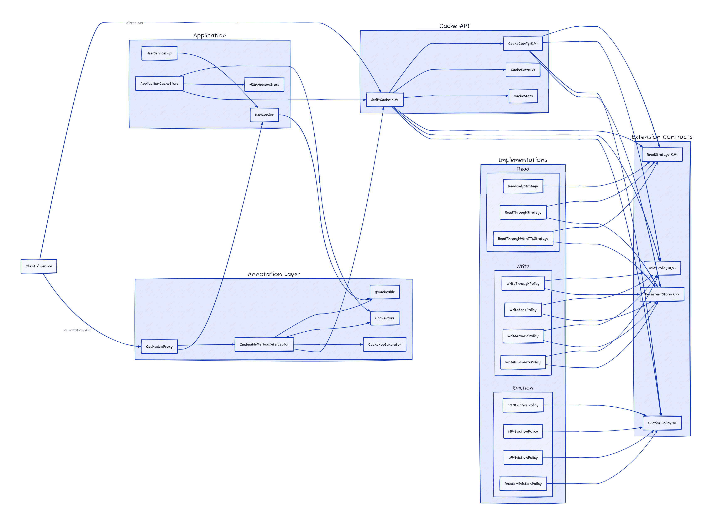

# SwiftCache

SwiftCache is a modular, in-memory caching library for Java with pluggable read strategies, write policies, and eviction policies.  
It also includes an annotation-based proxy layer (`@Cacheable`) for transparent method-level caching.

## Features

- Generic cache core: `SwiftCache<K, V>`
- Config-driven composition via `CacheConfig`
- TTL support per entry
- Scheduled cleanup of expired entries
- Cache statistics (`hits`, `misses`, `evictions`)
- Pluggable read strategies:
  - `ReadOnlyStrategy`
  - `ReadThroughStrategy`
  - `ReadThroughWithTTLStrategy`
- Pluggable write policies:
  - `WriteThroughPolicy`
  - `WriteBackPolicy`
  - `WriteAroundPolicy`
  - `WriteInvalidatePolicy`
- Pluggable eviction policies:
  - `FIFOEvictionPolicy`
  - `LRUEvictionPolicy`
  - `LFUEvictionPolicy`
  - `RandomEvictionPolicy`
- Annotation/proxy caching support:
  - `@Cacheable`
  - `CacheableProxy`
  - `CacheableMethodInterceptor`

## Project Structure

- `src/main/java/org/saahil`
  - Core cache: `SwiftCache`, `CacheConfig`, `CacheEntry`
  - Stats: `stats/CacheStats`
  - Persistence abstraction: `store/PersistentStore`
  - Read strategies: `strategy/read/*`
  - Write policies: `policy/write/*`
  - Eviction policies: `policy/eviction/*`
  - Annotation/proxy integration: `annotation/*`
  - Demo/example usage: `example/*`
- `src/test/java/org/saahil/example`
  - Integration and policy behavior tests

## How It Works

1. Build a `CacheConfig` with selected strategy/policies and persistent store.
2. Create `SwiftCache` with that configuration.
3. `get(key)` delegates read behavior to the configured `ReadStrategy`.
4. `put(key, value, ttl)` delegates write behavior to the configured `WritePolicy`.
5. On capacity pressure, `EvictionPolicy` selects a key to evict.
6. `CacheStats` tracks runtime metrics.
7. Optional: use `@Cacheable` + proxy for method-level transparent caching.

## Design Diagram



## Build & Test

Requirements:

- Java (JDK) installed
- Gradle wrapper (included)

Run tests:

```bash
./gradlew test
```

## Usage Example

```java
PersistentStore<String, Object> store = new H2InMemoryStore<>();

CacheConfig<String, Object> config = new CacheConfig<>(
        100,
        new ReadThroughStrategy<>(store),
        new WriteThroughPolicy<>(),
        new LRUEvictionPolicy<>(),
        store
);

SwiftCache<String, Object> cache = new SwiftCache<>(config);
cache.put("u:1", "John", java.util.concurrent.TimeUnit.MINUTES.toNanos(5));
Object value = cache.get("u:1");
```

### Annotation-Based Use Case with `@Cacheable`

```java
@CacheStore("users")
public class UserServiceImpl implements UserService {

    @Cacheable(ttl = 300)
    @Override
    public User findById(Long id) {
        // expensive call (DB/API)
        return loadUser(id);
    }
}

UserService service = CacheableProxy.createProxy(new UserServiceImpl(), UserService.class);
User user = service.findById(1L); // first call: loads and caches
User cached = service.findById(1L); // next call: served from cache
```

For details, see `org.saahil.annotation` and the use-case examples in `org.saahil.example`.